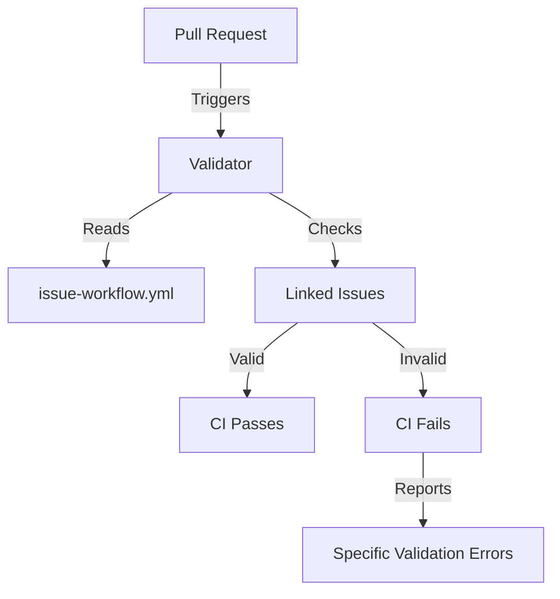

## Building GitHub Issue Hierarchies: A Practical Approach

This repository serves as a template for use in my AI workflow. Additionally, it can be used manually without any LLM API provider. This serves as a temporary workaround until the GitHub CLI or GitHub MCP includes a proper workflow.

Hint: This is a work in progress, with updates applied to my workflow.

## The Core Problem

During a recent project, I discovered three critical pain points in GitHub's native issue management:

  1. No validation for parent-child relationships between issues
  2. Manual status synchronization across dependent tasks
  3. Missing audit trail for workflow changes

This led to several incidents where completed features had unresolved dependencies, prompting me to create a code-based solution.



## Why Start with .sh?

I chose Bash scripting for the initial implementation because:

**Universal Availability**: Every Unix-like system has a shell interpreter  
**Minimal Dependencies**: No package managers or runtime environments needed  
**Rapid Prototyping**: Immediate feedback during development  
**Educational Value**: Clear, readable code for learning purposes  

The script handles these core functionalities through the GitHub CLI:

1. **Configuration Parsing**  
   Reads `.github/issue-workflow.yml` to understand:
   - Parent/child issue prefixes (e.g., `Epic:`/`Task:`)
   - Status mapping rules (blocking vs non-blocking relationships)
   - Validation requirements

2. **Hierarchy Validation**  
   For each issue:
   - Verifies required child issues exist
   - Checks parent/child status consistency
   - Validates cross-repository references

3. **Status Synchronization**  
   Automatically cascades status changes:

   ```bash
   # Example: When parent status changes
   if [ "$parent_status" == "In Progress" ]; then
     gh issue edit $child_issue --add-label "Active" 
   fi
   ```

4. **CI/CD Integration**  
   Runs validation during GitHub Actions workflows:
   - Blocks PRs with invalid issue dependencies
   - Generates visual issue graphs via Mermaid

5. **Audit Logging**  
   Maintains timestamped records of:
   - Workflow configuration changes
   - Issue relationship modifications
   - Status transition histories

- Issue relationship validation
- Status cascade logic
- Cross-reference checking

## Technical Implementation

### Configuration Setup

I define relationships in `.github/issue-workflow.yml`:

```yaml
# Core workflow rules
version: 2024.1

workflows:
  feature_development:
    parent_prefix: "Epic:"
    child_types:
      - prefix: "Task:"
        required: true
        status_map:
          "In Progress": "Active"
          "Done": "Needs Review"
      - prefix: "Research:"
        blocking: false

  documentation:
    parent_prefix: "Docs:"
    auto_close: true
    status_cascade: true
```

## CI Validation

The GitHub Action enforces these rules on every PR:

```yaml
name: Issue Workflow Validation
on: [pull_request, issues]

jobs:
  validate_issues:
    runs-on: ubuntu-latest
    steps:
      - uses: actions/checkout@v4
      - name: Check issue dependencies
        uses: d-oit/gh-sub-issues@v2
        with:
          config_path: .github/issue-workflow.yml
          validation_mode: strict
```

Key validation features:

- Blocks PRs with incomplete dependencies
- Enforces status transition rules
- Verifies correct issue type prefixes
- Generates visual dependency graphs

## Workflow Visualization



## Practical Benefits

Through regular use, I've observed:

1. **Reduced Oversights**: Automated checks prevent merging with unresolved dependencies
2. **Clearer Context**: Version-controlled workflow definitions serve as documentation
3. **Consistent Processes**: Status transitions follow codified rules across all repos
4. **Adaptable Workflows**: Configuration changes through standard PR review process

## Implementation Guide

### Installation

```bash
gh repo clone https://github.com/d-oit/gh-sub-issues
cp -r gh-sub-issues/.github your-project/
```

### Customization

Modify `issue-workflow.yml` using the [configuration documentation](https://github.com/d-oit/gh-sub-issues#configuration) in the README

### Integration

The validation action automatically runs on:

- New pull requests
- Issue modifications
- Workflow file changes

## Personal Usage Notes

In my daily work:

- I prefix all issue titles with type identifiers (`Epic:`, `Task:`, etc.)
- PR descriptions explicitly reference parent issues
- Configuration changes go through standard code review
- The system handles cross-repository dependencies

## Getting Started Suggestions

For new adopters, I recommend:

1. Start with basic parent-child relationships
2. Gradually add status mapping rules
3. Use the `--dry-run` flag during initial setup
4. Review validation reports before enabling strict mode

## Future Considerations

While Bash works well for the reference implementation, production systems might benefit from:

- **Python**: Better error handling and testing frameworks
- **Rust**: Memory safety and performance for large repositories
- **TypeScript**: Integration with existing web tooling

The core logic remains transferable across implementations.

## References

- [GitHub's sub-issues announcement](https://github.blog/engineering/architecture-optimization/introducing-sub-issues-enhancing-issue-management-on-github/)
- [Tilburg Science Hub - Issue Management](https://tilburgsciencehub.com/topics/automation/version-control/start-git/write-good-issues/)
- [GitProtect.io - GitHub Issues Guide](https://gitprotect.io/blog/mastering-github-issues-best-practices-and-pro-tips/)
